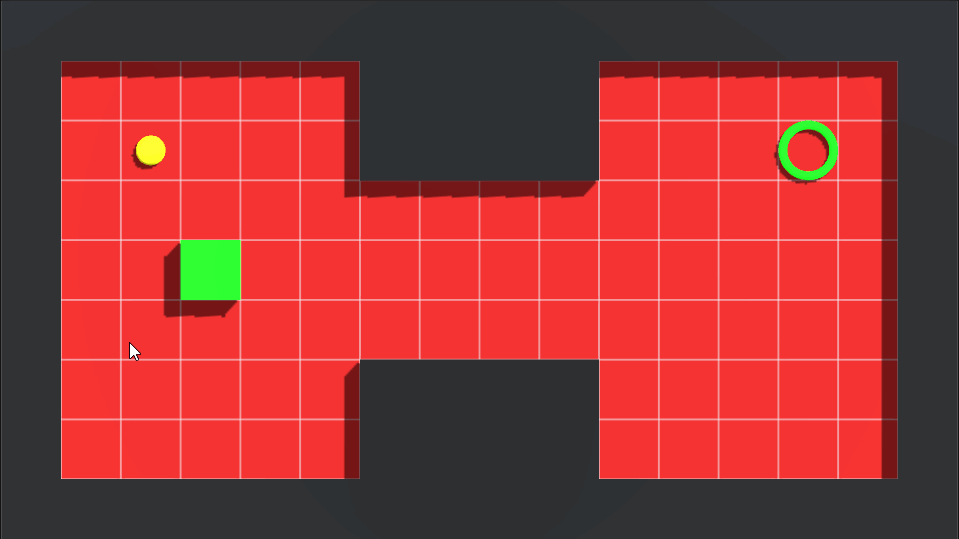
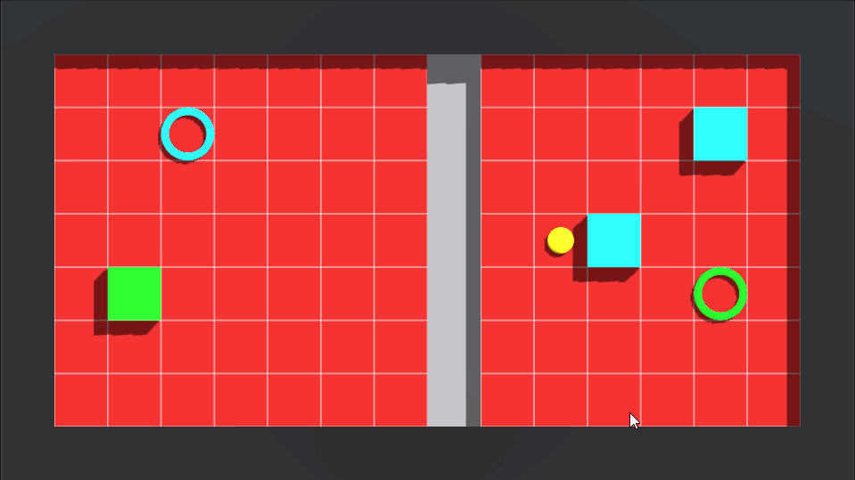
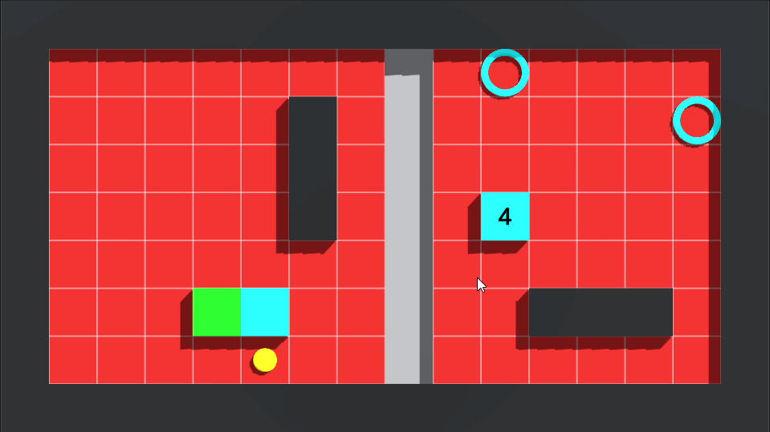

# Sokoban-Clone-Game
This is the work I did in **7 days** to create a clone of **Sokoban** game.

## Mechanics
* Grid movement
  * With WASD or arrow keys
  * Push
* Limited movement
* To fall
  * If the ball falls, it cannot move
  * If the box falls, it acts as a bridge
* Merge with the zone
* UI
  * Main menu
    * New game
    * Continue
    * Quit
  * In-game menu
    * Win
      * Next level
      * Replay
      * Quit
    * Stop
      * Continue
      * Replay
      * Quit

## Grid Generator
I also created a component that allows to easily create playgrounds on the Unity Editor side. [Click here](Assets/Scripts/GridGenerator).

## Gameplay

Level 1 | Level 2 | Level 3
------------ | ------------- | -------------
 |  | 

